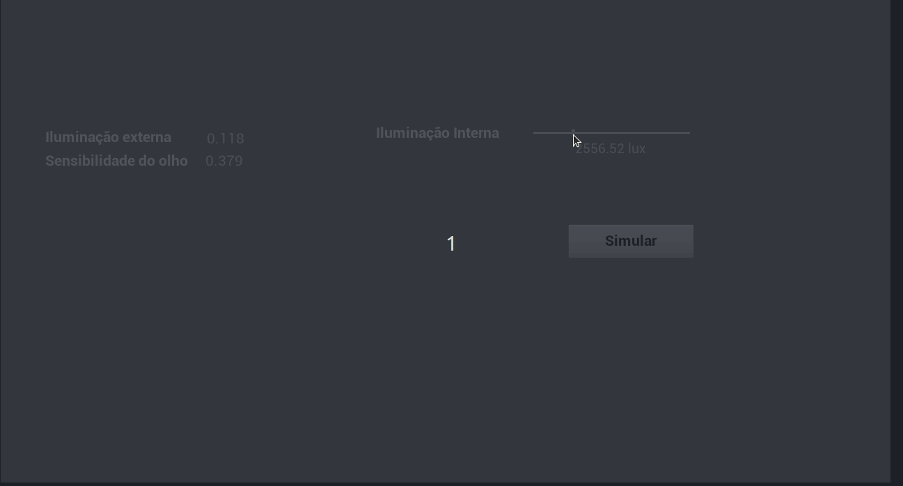

# Projeto integrador VI - Simulação em 3D
———————————————————————————

Centro Universitário Senac – Campus Santo Amaro     
Bacharelado em Ciência da Computação      
PI VI Simulação em 3D – 2º Semestre de 2018     
Prof. Maurício Marengoni     
Daniel Moniz Lucena Freire dos Santos e Henrique Shodi Maeta     

## Resumo
———————————————————————————

#### Definição do projeto:     
Escolher um certo fenômeno ou sistema que possua pelo menos duas variáveis estocástica e simular este sistema fazendo modificações nestas variáveis de forma a entender como o fenômeno/sistema deve funcionar. Apresentar o resultado da simulação através de uma animação em 3D usando computação gráfica.     

#### Proposta:     
Considerando a definição do projeto, nós desenvolvemos uma simulação em 3D que visa representar os efeitos causados por um ofuscamento da visão por conta de diferença de iluminação entre dois ambientes.     

## Introdução
———————————————————————————

Ao acordar, ou mudar de ambiente, ou até mesmo ao abrir uma cortina nós sofremos com a fotofobia ou sensibilidade à luz, ou seja, uma condição em que a pessoa não consegue olhar diretamente para luz ou ficar em ambientes claros, pois os olhos são agredidos. É um sintoma comum que está associado a várias condições diferentes, desde pequenas irritações até emergências médicas graves.     

Os casos leves podem fazer o paciente olhar para baixo ou cerrar os olhos em uma sala bem iluminada. Em casos mais graves, essa condição provoca dor considerável quando os olhos estão expostos a quase qualquer tipo de luz.     

Fotofobia não é uma doença, mas sim um sintoma de diversas outras condições. A sensibilidade à luz pode ser um sintoma de doenças que não afetam diretamente os olhos, tais como aquelas causadas por vírus ou então enxaqueca.     

Pessoas com olhos de cor clara podem experimentar fotofobia com mais frequência, uma vez que os pigmentos dos olhos ajudam a proteger da luz forte. Dessa forma, quanto menos pigmento têm os olhos, maiores as chances de agressão e sensibilidade.     

## Conceitos Fundamentais
———————————————————————————

A alternância entre a alta e a baixa iluminação faz com que o olho use alternadamente cones e bastones, o que causa a fadiga visual. Para acomodar-se, o olho se ajusta a diferentes distâncias dos objetos através dos seguintes mecanismos:     

Contração ou distinção dos músculos ciliares.     
Curvatura do cristalino.     

Portanto, quanto mais distante o objeto menor a visibilidade.     

#### Acomodação     
A visibilidade pode ser melhorada com a distância do objeto através do aumento da iluminação E (lux):     

Iluminância (lux)     
Distância do objeto (cm)
10
35
20
40
50
45
100
48
200
52
500
59
1000
63

#### Adaptação     
O olho ajusta-se à diferentes luminância dos objetos através da abertura e fechamento da pupila:     

- 0,001 cd/m2 -  bastonetes começam a operar e a pupila está totalmente aberta     
- 3 cd/m2 - cones começam a operar     
- 1.000 cd/m2 - a pupila fecha ao seu mínimo     

Para o olho acomodar-se à escuridão são necessários cerca de 30 minutos. Já para  acomodar-se a luz, toma cerca de 3 minutos.     

Fontes de iluminação     
Iluminância (lux)     
Céu sem nuvens no verão
100.000
Céu encoberto no verão
20.000
Plano de trabalho em sala com iluminação natural
1.000
Iluminação pública
20 à 40
Noite de lua cheia
0,25

#### Acuidade visual     

É a capacidade de ver distintamente detalhes em objetos ou superfícies. Dependendo de fatores como:     

- Idade     
- Iluminação do objeto     
- Tempo de exposição do objeto à vista     
- Luminância do fundo     

Podendo ser expressa numericamente através da seguinte expressão:     

a = 1 / ∆     

Onde ∆ é o ângulo subtendido pelo menor detalhe que a pessoa é capaz de perceber expresso em minutos.     

#### Luminância, Iluminância e Candela     

A candela é a unidade de medida básica do Sistema Internacional de Unidades para a intensidade luminosa. Ela é definida a partir da potência irradiada por uma fonte luminosa em uma particular direção. Seu símbolo é cd. E sua fórmula é dada em:     

Candela = Fluxo Luminoso /  ngulo sólido     

A Luminância a é uma medida da densidade da intensidade de uma luz refletida numa dada direção, cuja unidade SI é a candela por metro quadrado (cd/m²). Descreve a quantidade de luz que atravessa ou é emitida de uma superfície em questão, e decai segundo um ângulo sólido. Sua fórmula é dada por:     

L = I / A * cos ø     

Onde:     

L = Luminância     
I = Candela     
A = área do ambiente     
cos ø = Índice de refletância da superfície     

A iluminância faz a relação entre o fluxo luminoso que incide na direção perpendicular a uma superfície e a sua área. Na prática, é a quantidade de luz dentro de um ambiente.     
 
#### A sensibilidade Ocular

O limite de sensibilidade do olho humano depende de vários fatores, tais como o comprimento de onda da luz. Somos mais sensíveis à luz verde; neste caso, o limite de sensibilidade é da ordem de uma dezena de fótons/segundo. No vermelho ou no azul, precisamos de mais do que 100 fótons/segundo. Grosso modo, podemos estimar em 102 fótons/segundo o limite inferior da sensibilidade do olho humano.     

## Materiais e Métodos
———————————————————————————

A primeira parte deste trabalho consistiu em recolher informações suficientes a fim de se entender o problema de ofuscamento da visão e definir, de acordo com o prazo que nos foi proposto, quais ferramentas usaríamos e qual seria de fato a abordagem que tomaríamos para efetivar a simulação.     

Primeiro reunimos artigos que explicassem sobre o funcionamento do olho humano e as técnicas para calcular o ofuscamento da visão por causa da mudança de luminosidade em um determinado ambiente. Concluído a primeira etapa, iniciamos o processo de aprendizado da ferramenta para a criação dos modelos em 3D, onde foi usado a Unreal Engine 4.2.3, uma game engine desenvolvida pela empresa Epic Games. Para entender o uso da ferramenta é necessário o conhecimento prévio dos conceitos de computação de gráfica.     

Aplicação do modelo se embasou nos conceitos fundamentais absorvidos e citados previamente. Onde se decidiu aproveitar do uso ferramenta para abstrair os cálculos em questão, sendo possível focar mais na aplicação, entendimento dos conceitos, manipulação dos objetos e maior precisão na simulação apresentada.      

Como variáveis estocástica, decidimos que a primeira delas seria a sensibilidade do olho humano num range de 0, um olho ultra sensível, e o mínimo é 1, um olho quase sem sensibilidade a luz. E como segunda variável estocástica foi usado o candela (já explicado anteriormente), variando de 0cd à 2cd, influenciando o cálculo do tempo de ofuscamento sofrido.     

A simulação é realizada na primeira pessoa e consiste numa mudança de iluminação de um ambiente, onde o valor de luminância é escolhido pelo usuário, podendo controlar como seria a experiência da simulação de acordo com as entradas.      

## Simulação
———————————————————————————

Simulando com os valores de entrada:     
Iluminação externa = 1.85 cd/m²     
Sensibilidade do olho = 0.842 (alta)     
Iluminação Interna = 1963 lux     

